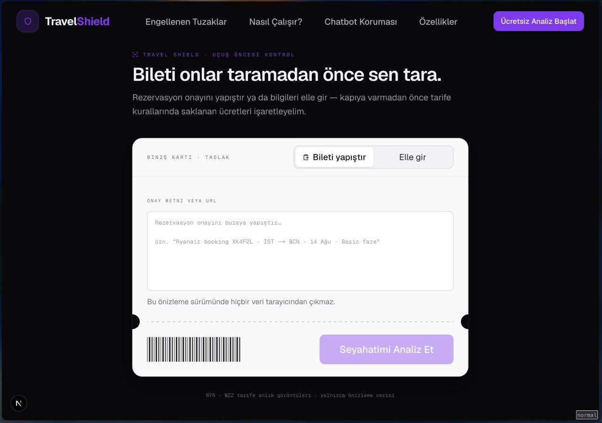
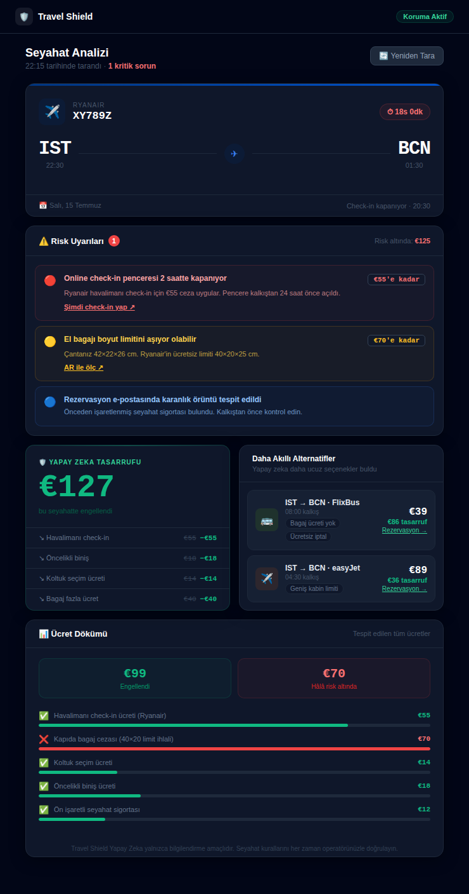

# Sprint 1
---
## Takım İsmi
Takım Travel-shield

## Takım Rolleri

Münevver Demir:  Scrum Master/Team Member/Developer    
Abdülaziz Kıran:  Product Owner/Team Member/Developer       
Yasin Ünsal:  Team Member/Developer      
Umut Can Karaman:  Team Member/Developer      

## Ürün İsmi

--Travel-Shield--

## Ürün Açıklaması

- Düşük maliyetli havayolları ve bölgesel tren operatörlerinin (Ryanair, Trenitalia vb.) karmaşık kurallar ve dijital tuzaklar üzerinden kestiği ağır operasyonel cezalara karşı bütçeli gezginleri koruyan yapay zeka ajanlı bir seyahat asistanı.

## Ürün Özellikleri

- Uçuş check-in'leri tamamlamanız için sizi bilgilendirir.
- PDF iptal tuzaklarını bloke eder
- Bölgesel trenleri kalkış anında otonom olarak doğrular,
- Kapıda bagaj cezasını engeller. 

## Hedef Kitle

- Gen Z ve Millennial Bütçeli Gezginler  
- Interrail Kullanıcıları
- Çoklu Modlu (Multimodal) Seyahat Edenler
- Seyahat planlamayı seven tüm kullanıcılar 

## Product Backlog URL

https://trello.com/b/WQPd2syn/takim-127

---

# Sprint 1: 📋 Scrum ve Proje Yönetimi Raporu

---
### A. Backlog Dağıtma Mantığı : Backlog Düzeni & Story seçimleri & Görev Dağılımı (Efor: 21 SP)

Backlog'umuz öncelikli story'lere göre düzenlenmiştir. Sprint başına tahmin edilen puan sayısını geçmeyecek şekilde sıradan seçimler yapılmaktadır. Story başına çıkan tahmin puanı, toplam puanın yarısından az tutulmuştur. Story'ler yapılacak işlere (task'lere) bölünmüştür. 
Trello Board'da gözüken turuncu item'lar öncelikli yapılacak görevleri (task) gösterirken, mor item'ler turuncu adımlar tamamlandıktan sonra ki adımları, sarı item'ler proje yönetimi için ana adımları temsil etmektedir.  

Süreç içerisinde git merge çakışmalarını (conflict) sıfıra indirmek adına görevler **sayfa rotalarına (routes) ve atomik bileşen mimarisine** göre bölünmüştür.

| İş Kimliği | Görev / Kullanıcı Hikayesi | Sorumlu | Efor (SP) | İlgili Rota / Klasör |
| --- | --- | --- | --- | --- |
| **TS-101** | Proje setup, Tailwind premium dark konfigürasyonu ve temel `shadcn/ui` atomik bileşenlerinin kurulumu. | **Abdülaziz** | 3 SP | `/components/ui` |
| **TS-102** | Ana Sayfa (Landing Page) arayüzünün, sorun (ceza tuzakları) ve değer önerisi odaklı responsive geliştirilmesi. | **Abdülaziz** | 5 SP | `/app/page.tsx` |
| **TS-103** | Kullanıcının seyahat bilgilerini gireceği `/analyze` giriş formunun ve bilet yapıştırma alanının UI tasarımı. | **Yasin** | 4 SP | `/app/analyze` |
| **TS-104** | "Analiz Et" butonuna basıldığında tetiklenecek "AI Ajanları kuralları okuyor..." loading ve yazma animasyonu. | **Yasin** | 2 SP | `/app/analyze` |
| **TS-105** | Seyahate özgü üst düzey akıllı bileşenlerin (`RiskCard`, `SavingsCard`, `AlternativeTransportCard`) geliştirilmesi. | **Münevver** | 4 SP | `/components/dashboard` |
| **TS-106** | Tüm dashboard bileşenlerinin `/dashboard` rotasında mockup JSON verisiyle beslenerek son kullanıcı ekranı olarak birleştirilmesi. | **Münevver** | 3 SP | `/app/dashboard` |
| **TS-107** | Sınav haftasında olması nedeniyle önümüzdeki hafta görev dağılımı dengelenecektir . | **Umut Can** | - | 

### B. Daily Scrum Notları:
Daily Scrum toplantılarında daha hızlı aksiyon alınması için WhatApp üzerinden ilerlenmiş, ekip üyelerinin müsait olduğu günlerde Slack üzerinden toplantı yapılmasına karar verilmiştir. Daily Scrum toplantısı örneği jpeg veya word olarak Readme'de tarafımızdan paylaşılmaktadır: 
[DailyScrumMeetingNotesSprint1.docx](https://github.com/user-attachments/files/29614065/DailyScrumMeetingNotesSprint1.docx)

### C. Sprint Board Updates: Ekran görüntüleri

### D. Ürün Durumu: Ekran görüntüleri

Sprint 1 ekran görüntüleri çıktısı, uçtan uca çalışan fütüristik bir **Frontend Prototipidir**. Kullanıcı ana sayfadan giriş yapar, `/analyze` rotasında biletini simüle eder, AI analiz animasyonunu deneyimler ve ardından seyahat risklerini gösteren `/dashboard` paneline sorunsuz yönlendirilir.

### E. Sprint Review:

Neler Tamamlandı ?: Next.js projesinin çalışma hızı, landing page tasarımlarının mobil uyumluluğu, form sayfasındaki AI loading animasyonunun gerçekçiliği ve dashboard üzerindeki risk kartlarının görsel netliği canlı olarak tarayıcıda gösterildi.

Alınan Geri Bildirimler: Tasarım sisteminin renk paletinin (LCC/karanlık örüntü vurgusu için premium koyu tema) çok başarılı olduğu; ancak sonraki sprintte eklenecek olan gerçek LLM API entegrasyonu için mock verilerin biraz daha detaylandırılması gerektiği gözlemlendi.

Onay Durumu: Ürün, ilk sprint için belirlenen "Görsel ve Tıklanabilir Protokol" hedefini %100 karşıladığı için ekip üyeleri tarafından kabul edildi. Bir sonraki sprintte devreye girecek gerçek AI Agent orkestrasyonu (CrewAI/FastAPI) öncesinde arayüz akışının kusursuz çalıştığı doğrulandı.

### F. Sprint Retrospective:

* **🟢 Ne İyi Gitti?:** Sorumluluklar sayfa bazlı ayrıldığı için sıfır git çakışması (merge conflict) ile çalışıldı. Tasarım dili baştan sabitlendiği için kodlama hızı arttı.
  
* **🔴 Ne Geliştirilebilir?:** Formdan gönderilen değişken isimleri ile dashboard'un beklediği veri tiplerinde (TypeScript interfaces) ilk saatlerde senkronizasyon hatası yaşandı.
  
* **🛠️ Aksiyon Planı:** Sprint 2'de ilk iş olarak ortak bir `types/index.ts` dosyası açılarak tüm veri sözleşmeleri (data contracts) tek elden yönetilecektir. Konuşulan ek özellikler geliştirilerek, eklenecektir. Takım içindeki görev dağılımı önümüzdeki haftalarda bir ekip üyesi daha katılacağından dolayı dengelenecektir.

---

# Sprint 2

## Takım İsmi
Takım Travel-shield

## Takım Rolleri

Münevver Demir:  Scrum Master/Team Member/Developer    
Abdülaziz Kıran:  Product Owner/Team Member/Developer       
Yasin Ünsal:  Team Member/Developer      
Umut Can Karaman:  Team Member/Developer      

## Ürün İsmi

--Travel-Shield--

## Ürün Açıklaması

- Travel Shield AI, bütçeli gezginlerin seyahat maliyetlerini öngörülemeyen cezalardan koruyan bir "Operasyonel Risk Kalkanı"dır. Havayolu firmalarının karmaşık bilet kurallarını, check-in zaman pencerelerini ve bagaj sınırlamalarını analiz ederek kullanıcılara cezaya düşmeden önce aksiyon aldıran akıllı bir asistan görevi görür. Sprint 2 itibarıyla, pazardaki onay süreçlerinin getirdiği riskleri minimize etmek adına "Omnichannel Chatbot" (Telegram/WhatsApp) vizyonunu arayüze entegre ederek büyüme stratejisini jüriye çalışır bir prototiple gösterir.

## Ürün Özellikleri

- AI Ticket & Booking Scanner: Kullanıcının ham bilet metnini veya manuel girdilerini tarayarak gizli cezaları analiz eden motor.
- Centralized State Engine (Hafıza Katmanı): Kullanıcı verilerini formdan dashboard'a kayıpsız aktaran React Context yapısı.
- Premium Dark Workspaces: Kullanıcıya lüks ve yüksek teknoloji hissi veren karanlık mod arayüz birliği.
- Resilient Empty State: Hatalı sayfa geçişlerini engelleyen ve kullanıcıyı akışa sadık tutan koruma paneli.
- Omnichannel Chatbot Teaser: WhatsApp ve Telegram bot entegrasyonlarının gelecekteki yerini gösteren QR ve bilet sürükle-bırak (drop) kartları.

## Hedef Kitle

- Gen Z & Millennial Bütçeli Gezginler  & Sırt Çantalılar: Ekstra 40€ bagaj veya check-in cezası ödemesi bütçesini tamamen sarsacak olan genç kitle.
- Sık Seyahat Eden İş İnsanları/Dijital Göçmenler: Farklı havayollarının kurallarını akılda tutmakla vakit kaybetmek istemeyen profesyoneller.
- Erasmus ve Değişim Programı Öğrencileri: Avrupa içinde bölgesel ulaşım ağlarını (Trenitalia, Ryanair) aktif kullanan öğrenciler.
- Interrail Kullanıcıları
- Çoklu Modlu (Multimodal) Seyahat Edenler
- Seyahat planlamayı seven tüm kullanıcılar

## Product Backlog URL

https://trello.com/b/WQPd2syn/takim-127

---

# Sprint 2: 📋 Scrum ve Proje Yönetimi Raporu

---
### A. Backlog Dağıtma Mantığı : Backlog Düzeni & Story seçimleri & Görev Dağılımı (Efor: 21 SP)

Backlog'umuz öncelikli story'lere göre düzenlenmiştir. Sprint başına tahmin edilen puan sayısını geçmeyecek şekilde sıradan seçimler yapılmaktadır. Story başına çıkan tahmin puanı, toplam puanın yarısından az tutulmuştur. Story'ler yapılacak işlere (task'lere) bölünmüştür. 
Trello Board'da gözüken turuncu item'lar öncelikli yapılacak görevleri (task) gösterirken, mor item'ler turuncu adımlar tamamlandıktan sonra ki adımları, sarı item'ler proje yönetimi için ana adımları temsil etmektedir.  

Süreç içerisinde git merge çakışmalarını (conflict) sıfıra indirmek adına görevler **sayfa rotalarına (routes) ve atomik bileşen mimarisine** göre bölünmüştür.

| İş Kimliği | Görev / Kullanıcı Hikayesi                                                                    | Sorumlu       | Efor (SP) | İlgili Rota / Klasör |
|------------|-----------------------------------------------------------------------------------------------|---------------|-----------| --- |
| **TS2-01** | Global State (TravelContext) Yapısının Kurulması                                              | **Abdülaziz** | 5 SP      | `src/types/travel.ts` |
| **TS2-02** | Premium Dark Tema Eşitlemesi & Global CSS                                                     | **Abdülaziz** | 3 SP      | `src/context/TravelContext.tsx` |
| **TS2-03** | Omnichannel Chatbot Landing Page Kartlarının Yazılması                                        | **Abdülaziz** | 3 SP      | `src/app/layout.tsx` |
| **TS2-04** | /analyze Sayfası Kontrollü Form Tasarımı & State Bağlantısı                                   | **Yasin**     | 5 SP      | `src/app/analyze/page.tsx` |
| **TS2-05** | Form Verilerinin runAiSimulation ile Context'e Paslanması                                     | **Yasin**     | 2 SP      | `src/app/analyze/page.tsx` |
| **TS2-06** | /dashboard Statik Dosya Bağlantısının Koparılması & useTravel() Entegrasyonu                  | **Münevver**  | 3 SP      | `src/app/dashboard/page.tsx` |
| **TS2-07** | NULL Analiz Sonucu için Resilient Empty State Ekranı Yapımı                                   | **Münevver**  | 4 SP      | `src/app/dashboard/page.tsx` |
| **TS2-08** | Bütünleme sınavı haftasında olması nedeniyle önümüzdeki hafta görev dağılımı dengelenecektir. | **Umut Can**  | -         | 

### B. Daily Scrum Notları- Sprint 2:
Daily Scrum toplantılarında daha hızlı aksiyon alınması için WhatApp üzerinden ilerlenmiş, ekip üyelerinin müsait olduğu günlerde Slack üzerinden toplantı yapılmasına karar verilmiştir. Daily Scrum toplantısı örneği jpeg veya word olarak Readme'de tarafımızdan paylaşılmaktadır:
[DailyScrumMeetingNotesSprint2.docx](https://github.com/user-attachments/files/30170621/DailyScrumMeetingNotesSprint2.docx)

### C. Sprint 2 Board Updates: Ekran görüntüleri

### D. Ürün Durumu: Ekran görüntüleri

[product_ss_1.pdf](https://github.com/user-attachments/files/30153879/product_ss_1.pdf)

Sprint 2 sonunda elde edilen ürün; kullanıcı girdilerine dinamik olarak tepki veren, durum yönetimli (stateful) ve çok kanallı (omnichannel) büyüme vizyonuna sahip üst segment bir frontend prototipidir. Sunucu ihtiyacı duymadan, istemci tarafında gelişmiş yapay zeka ajan tarama simülasyonunu başarıyla oluşturur.

### E. Sprint Review:

Nihai MVP başarılı bir şekilde oluşturuldu. Ekip üyelerinin yaptığı demoda, havayolu firmasındaki bagaj seçeneğinin değiştirilmesiyle dashboard'daki "Risk Oranı" ve "Gizli Maliyet" grafiklerinin gerçek zamanlı olarak değiştiği gösterildi. WhatsApp/Telegram chatbotunun aktifleşip, yasal izinlerinlerin alınması üzerine hızlıca aksiyon alınması üzerine tartışıldı.

### F. Sprint Retrospective:

* **🟢 Ne İyi Gitti?:** React Context sayesinde sunucusuz bir uygulamada sanki arkada gerçek bir veritabanı varmış gibi dinamik bir akış yakalandı. Tasarım bütünlüğü sağlandı.
  
* **🔴 Ne Geliştirilebilir?:** 2.6 saniyelik animasyon senkronizasyonunu yakalamak için zaman aşımı (setTimeout) sürelerini kod içinde manuel eşitlemek zorunda kaldık. Bir sonraki geliştirme fazında merkezi bir animasyon zamanlayıcısı (event emitter) kurulabilir.
  
* **🛠️ Aksiyon Planı:** Gerçek API onay süreçleri (Twilio/Telegram Bot API) için gereklilikler hazırlanacak ve backend entegrasyonuna başlanıp, ürünün son hali tamamlanacak.

---

# Sprint 3

---
